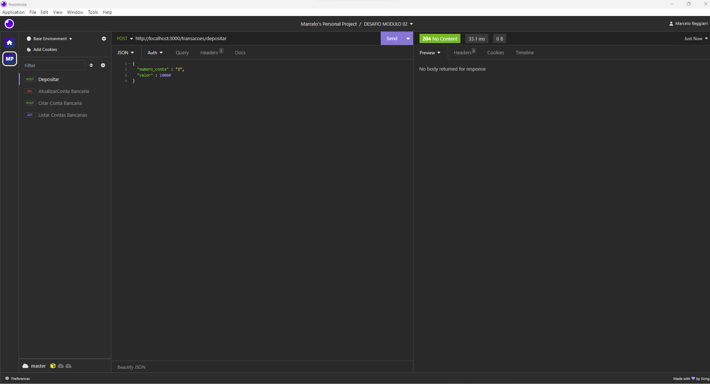
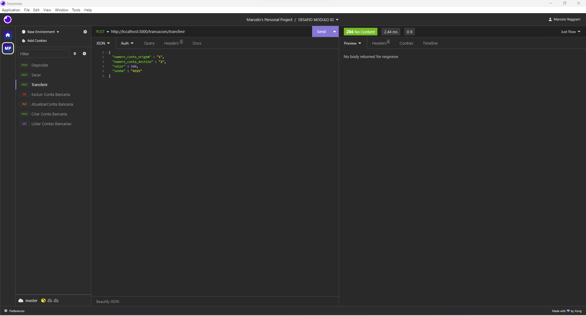
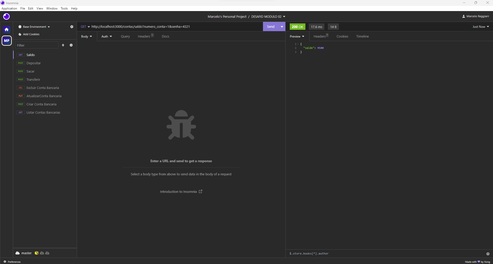
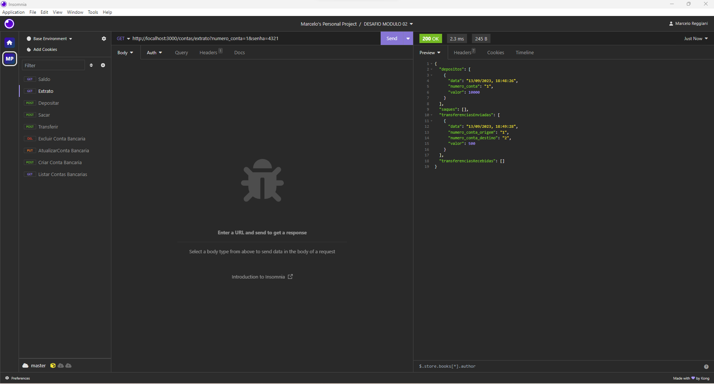

# Desafio Módulo 2 - Back-end

## Descrição do Projeto

Trata-se de uma API para controlar um banco digital. Com ele você será capaz de criar contas, alterar dados da conta, excluir conta, fazer depositos, saques, transferencias entre contas. Consultar saldos e extratos.

## Funcionalidades de uma API para um Banco Digital!

Esta API que permite:

-   Criar conta bancária
-   Listar contas bancárias
-   Atualizar os dados do usuário da conta bancária
-   Excluir uma conta bancária
-   Depósitar em uma conta bancária
-   Sacar de uma conta bancária
-   Transferir valores entre contas bancárias
-   Consultar saldo da conta bancária
-   Emitir extrato bancário

### ⚠️ 📋 Pré-requisitos

- [ ] Precisa ter o Node.Js  Instalado
- [ ] Executar o comando NPM INSTALL no diretório do projeto para baixar as dependencias!
- [ ] Você pode usar o aplicativo INSOMNIA para realizar os testes no projeto


## Persistências dos dados

Os dados serão persistidos em memória, no objeto existente dentro do arquivo `bancodedados.js`. 

### Estrutura do objeto no arquivo `bancodedados.js`

```javascript
{
    banco: {
        nome: "Cubos Bank",
        numero: "123",
        agencia: "0001",
        senha: "Cubos123Bank",
    },
    contas: [
        // array de contas bancárias
    ],
    saques: [
        // array de saques
    ],
    depositos: [
        // array de depósitos
    ],
    transferencias: [
        // array de transferências
    ],
}
```
## Requisitos que o projeto segue

-   API segue o padrão REST
-   O código esta organizado, delimitando as responsabilidades de cada arquivo adequadamente abaixo:
    -   Um arquivo index.js
    -   Um arquivo de rotas
    -   Um pasta com controladores, que possui os arquivos de transferencia e de conta, assim como o arquivo de validação.
-   


## Endpoints

### Listar contas bancárias

#### `GET` `/contas?senha_banco=Cubos123Bank`

Esse endpoint deverá listar todas as contas bancárias existentes.

-   Funcionalidades

    -   Verificar se a senha do banco foi informada (passado como query params na url)
    -   Verifique se existe alguma conta cadastrada
    -   Validar se a senha do banco está correta


### Criar conta bancária

#### `POST` `/contas`

Esse endpoint deverá criar uma conta bancária, onde será gerado um número único para identificação da conta (número da conta).

-   Funcionalidades:

    -   Criar uma nova conta cujo número é único
    -   CPF deve ser um campo único.
    -   E-mail deve ser um campo único.
    -   Verificar se todos os campos foram informados (todos são obrigatórios)
    -   Definir o saldo inicial da conta como 0

-   **Requisição** - O corpo (body) deverá possuir um objeto com as seguintes propriedades (respeitando estes nomes):

    -   nome
    -   cpf
    -   data_nascimento
    -   telefone
    -   email
    -   senha

    


### Atualizar usuário da conta bancária

#### `PUT` `/contas/:numeroConta/usuario`

Esse endpoint deverá atualizar apenas os dados do usuário de uma conta bancária.

-   Funcionalidades:

    -   Verificar se foi passado todos os campos no body da requisição
    -   Verificar se o numero da conta passado como parametro na URL é válida
    -   Se o CPF for informado, verificar se já existe outro registro com o mesmo CPF
    -   Se o E-mail for informado, verificar se já existe outro registro com o mesmo E-mail
    -   Atualizar os dados do usuário de uma conta bancária

-   **Requisição** - O corpo (body) deverá possuir um objeto com todas as seguintes propriedades (respeitando estes nomes):

    -   nome
    -   cpf
    -   data_nascimento
    -   telefone
    -   email
    -   senha


### Excluir Conta

#### `DELETE` `/contas/:numeroConta`

Esse endpoint deve excluir uma conta bancária existente.

-   Funcionalidades:

    -   Verificar se o numero da conta passado como parametro na URL é válido
    -   Permitir excluir uma conta bancária apenas se o saldo for 0 (zero)
    -   Remover a conta do objeto de persistência de dados.

-   **Requisição**

    -   Numero da conta bancária (passado como parâmetro na rota)


### Depositar

#### `POST` `/transacoes/depositar`

Esse endpoint deverá somar o valor do depósito ao saldo de uma conta válida e registrar essa transação.

-   Funcionalidades:

    -   Verificar se o numero da conta e o valor do deposito foram informados no body
    -   Verificar se a conta bancária informada existe
    -   Não permitir depósitos com valores negativos ou zerados
    -   Somar o valor de depósito ao saldo da conta encontrada

-   **Requisição** - O corpo (body) deverá possuir um objeto com as seguintes propriedades (respeitando estes nomes):

    -   numero_conta
    -   valor




### Sacar

#### `POST` `/transacoes/sacar`

Esse endpoint deverá realizar o saque de um valor em uma determinada conta bancária e registrar essa transação.

-   Funcionalidades:

    -   Verificar se o numero da conta, o valor do saque e a senha foram informados no body
    -   Verificar se a conta bancária informada existe
    -   Verificar se a senha informada é uma senha válida para a conta informada
    -   Verificar se há saldo disponível para saque
    -   Subtrair o valor sacado do saldo da conta encontrada

-   **Requisição** - O corpo (body) deverá possuir um objeto com as seguintes propriedades (respeitando estes nomes):

    -   numero_conta
    -   valor
    -   senha


### Tranferir

#### `POST` `/transacoes/transferir`

Esse endpoint deverá permitir a transferência de recursos (dinheiro) de uma conta bancária para outra e registrar essa transação.

-   Funcionalidades:

    -   Verificar se o número da conta de origem, de destino, senha da conta de origem e valor da transferência foram informados no body
    -   Verificar se a conta bancária de origem informada existe
    -   Verificar se a conta bancária de destino informada existe
    -   Verificar se a senha informada é uma senha válida para a conta de origem informada
    -   Verificar se há saldo disponível na conta de origem para a transferência
    -   Subtrair o valor da transfência do saldo na conta de origem
    -   Somar o valor da transferência no saldo da conta de destino

-   **Requisição** - O corpo (body) deverá possuir um objeto com as seguintes propriedades (respeitando estes nomes):

    -   numero_conta_origem
    -   numero_conta_destino
    -   valor
    -   senha




### Saldo

#### `GET` `/contas/saldo?numero_conta=123&senha=123`

Esse endpoint deverá retornar o saldo de uma conta bancária.

-   Funcionalidades:

    -   Verificar se o numero da conta e a senha foram informadas (passado como query params na url)
    -   Verificar se a conta bancária informada existe
    -   Verificar se a senha informada é uma senha válida
    -   Exibir o saldo da conta bancária em questão

-   **Requisição** - query params

    -   numero_conta
    -   senha




### Extrato

#### `GET` `/contas/extrato?numero_conta=123&senha=123`

Esse endpoint deverá listar as transações realizadas de uma conta específica.

-   Funcionalidades:

    -   Verificar se o numero da conta e a senha foram informadas (passado como query params na url)
    -   Verificar se a conta bancária informada existe
    -   Verificar se a senha informada é uma senha válida
    -   Retornar a lista de transferências, depósitos e saques da conta em questão.

-   **Requisição** - query params

    -   numero_conta
    -   senha



###### tags: `back-end` `módulo 2` `nodeJS` `API REST` `desafio`
